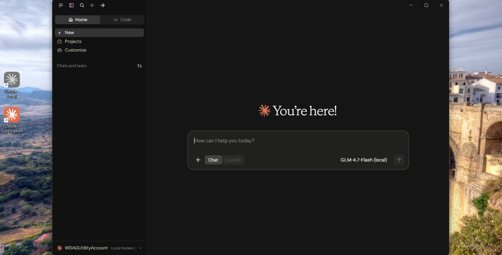

**English** | [Українська](README.uk.md) | [Русский](README.ru.md)

# Claude Desktop on a local model (GLM-4.7-Flash + Ollama)

Claude Desktop running on the local GLM-4.7-Flash model through Ollama: no subscription, no cloud.
The regular Claude subscription can run next to it in a separate window.



- **Model:** GLM-4.7-Flash, a 30B MoE (~3B active), up to 131K context. On an i9-12900KS + RTX 3070
  8 GB it generates 30–32 tokens/s.
- **Documents:** PDF, DOCX and scans (OCR) through the bundled `docs` MCP server and MinerU, all local.
- **Web search:** a self-hosted SearXNG in Docker; without Docker, DuckDuckGo. No paid APIs.
- **Two windows at once:** "Claude - Local" with grey icons and "Claude - Subscription" with orange ones.

## Requirements

| | Minimum | Recommended |
|---|---|---|
| Windows | 10/11 | 11 |
| RAM | 24 GB | 32–64 GB |
| Graphics | optional (slow without it) | NVIDIA, 8 GB or more |
| Disk | 25 GB free on the drive with the install folder | SSD |
| Programs | [Claude Desktop](https://claude.ai/download) | + Docker Desktop for SearXNG |

The installer sets up Ollama, uv, MinerU and the Visual C++ runtime by itself. It uses winget when
available and the vendors' official installers otherwise.

## Installation

1. Install [Claude Desktop](https://claude.ai/download).
2. Download the latest release — **Source code (zip)** on the [Releases page](../../releases/latest) — and unzip it
   into a folder with a plain Latin path, for example `C:\AI\Claude-Local`.
3. In PowerShell run:

   ```powershell
   powershell -ExecutionPolicy Bypass -File C:\AI\Claude-Local\install.ps1
   ```

4. Start the **"Claude - Local"** shortcut on the desktop.

The installer picks the thread count and the context length for your computer, and shows its
messages in the Windows display language (English, Ukrainian or Russian; force one with
`-Lang en|uk|ru`). It is safe to run again: finished steps are skipped. At the end it prints a table
of what worked and what did not.

### Options

| Option | What it does |
|---|---|
| `-ModelsDir <folder>` | Keep the models somewhere else. By default they go into `models` inside the install folder, so the whole setup stays in one place; an Ollama that already has the model keeps its own folder |
| `-ModelSource <folder>` | Copy `glm-4.7-flash` from an Ollama models folder where it is already downloaded (another PC, a USB drive) instead of downloading ~18 GB |
| `-ContextLength 65536`, `-Threads 8` | Override the automatic choice |
| `-NoSearxng` | Do not start SearXNG (search then uses DuckDuckGo) |

## Tested

`tests\sandbox-test.ps1` runs the installer on a clean, throwaway Windows (Windows Sandbox, no GPU):
every step and all 7 checks pass, including a reply from the model and OCR through MinerU.

## Documentation

[HANDBOOK.md](HANDBOOK.md) is the full guide: how everything fits together, checks, troubleshooting
and what must not be changed. [scripts/README.md](scripts/README.md) explains the design decisions
and the measurements behind them.

## Disclaimer

- This is an unofficial community project. It is **not affiliated with, endorsed or sponsored by
  Anthropic**, Z.ai (GLM), Ollama or any other vendor. "Claude" and the Claude logo are trademarks of
  Anthropic; other names are trademarks of their owners and are used only to describe compatibility.
- The repository contains **no third-party software, models or logos**. The installer downloads
  everything from the official sources, and the icons are built on your own computer from the Claude
  Desktop you installed. Each component stays under its own licence and terms: [Claude Desktop](https://www.anthropic.com/legal/consumer-terms),
  [GLM-4.7-Flash (MIT)](https://huggingface.co/zai-org/GLM-4.7-Flash), [Ollama (MIT)](https://github.com/ollama/ollama),
  [MinerU](https://github.com/opendatalab/MinerU/blob/master/LICENSE.md), [SearXNG (AGPL-3.0)](https://github.com/searxng/searxng),
  [uv](https://github.com/astral-sh/uv). You are responsible for complying with them.
- The software is provided **as is, without warranty of any kind**, and you use it at your own risk
  (see [LICENSE](LICENSE)). It changes user settings (environment variables, a Claude Desktop profile,
  shortcuts) and downloads about 20 GB.
- Local AI models can be wrong. Check important results yourself.
